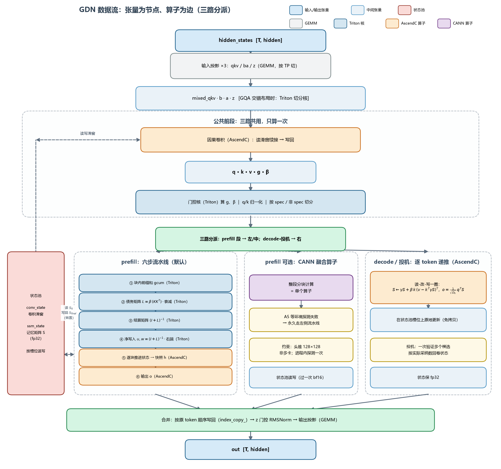

# GDN 算子实现解析（vllm-ascend）

这份文档讲 vllm-ascend 里 GDN 算子（Gated Delta Net，一种线性注意力层）是怎么实现的，面向没读过代码的读者。文中出现的函数名、算子名都只是"想去看代码时用来定位的锚点"，每个名字第一次出现时都会先说它是干什么的。每一节尽量自包含，哪个概念卡住了，按小节名就能定位（比如"③ 下三角求逆"看不懂，就回 §4.1 对应段落；某个名字想不起来，回 §0 出场人物表查）。

算法原理在配套的 `GDN_Principles.md` 里，这里只要求你知道一句话：GDN 给每条序列维护一个固定大小的记忆矩阵 S，逐 token 做"衰减、检索旧值、写差额、读出"。三张配图在 `gdn_diagrams/` 目录下，正文相应位置会引用。

## 0. 出场人物

后面会反复提到这些名字，先混个脸熟，忘了随时翻回来：

| 名字 | 干什么的 | 哪来的 |
|---|---|---|
| `gdn.py` 里的 `_forward_core` | GDN 层的 Python 实现，核心计算都在这个函数里 | 本仓 `vllm_ascend/ops/` |
| `gdn_attn_builder.py` | 给每层计算准备索引、切分等"排班表" | 本仓 `vllm_ascend/ops/` |
| `npu_causal_conv1d_custom` | 因果卷积算子 | 本仓 C++ 手写（AscendC） |
| `fused_gdn_gating` | 算两个门的核 | 本仓 Triton |
| `npu_recurrent_gated_delta_rule` | decode/投机解码用的逐 token 递推算子 | 本仓 AscendC |
| `chunk_gated_delta_rule_fwd_h` | prefill 用的跨块状态推进算子 | 本仓 AscendC |
| `chunk_fwd_o` | prefill 用的输出计算算子 | 本仓 AscendC |
| `npu_chunk_gated_delta_rule` | 整条 prefill 流水线的官方融合版 | 华为 CANN（torch_npu 自带） |
| `chunk_local_cumsum` 等四个 | 分块算法的中间步骤核 | 本仓 Triton（`ops/triton/fla/`） |

顺带说明"算子"的三个来源，后文会混用这三个词：**AscendC 算子**是本仓 `csrc/` 下用 C++ 给 NPU 手写、编译后供 Python 调用的；**Triton 核**是用 Triton 语言（一种写计算核的 Python 方言）写的，本仓做了 NPU 适配；**CANN 算子**是华为官方库里的现成实现。

代码目录速览：Python 层在 `vllm_ascend/ops/`，Triton 核在 `vllm_ascend/ops/triton/`，AscendC 算子源码在 `csrc/attention/`，310P 老设备另有一套实现在 `vllm_ascend/_310p/`。

## 1. 整体印象

和 Softmax 注意力比，GDN 不用 KV Cache：

| | Softmax Attention | GDN |
|---|---|---|
| 复杂度 | O(T²) | O(T) |
| 状态 | KV Cache，随长度线性增长 | 固定大小状态 S |
| 生成一步 | 扫全部历史 KV | 一次状态递推，O(1) |

vllm-ascend 没有把递推写死成一个 kernel，而是按 token 类型拆成三条路径：prefill（处理整段 prompt）走分块并行，decode（逐个生成）走递推，投机解码走多 token 验证（复用 decode 的算子）。三条路径算的是同一个递推公式，只是执行方式不同，最后把结果拼回原始 token 顺序，调用方感知不到内部分过路。


## 2. forward：三段式

`forward()`（在 gdn.py 第 181 行附近）就三段：输入投影、核心注意力、输出投影。

投影部分按模型配置分两条路。较新的结构分三次投影：一次出 q、k、v 拼在一起的向量，一次出两个门的原料 b 和 a，一次出输出门 z（对应代码里的三个成员 `in_proj_qkv`、`in_proj_ba`、`in_proj_z`）。老结构把 qkv 和 z 合成一次投影（`in_proj_qkvz`），算完再按 TP 的宽度切开。如果碰上 GQA 交错布局（v 头和 k 头交错排布的模型结构），投影输出的排列是"按头组交错"的，普通切法要多次拷贝才能归位，这时会改用一个 Triton 核把"切分、重排、拼接"三件事合成一次读写（`fused_qkvzba_split_reshape_cat`）。b 和 a 都会做 `.contiguous()`，因为后面的核要求内存连续。

核心注意力这段被包成一个 custom op：

```python
core_attn_out = torch.zeros(...)                     # 用 zeros 而非 empty，原因见下
torch.ops.vllm.qwen_gdn_attention_core(              # custom op 包装 _forward_core
    mixed_qkv, b, a, core_attn_out, self.prefix, False)
```

这里有两个容易看漏的细节。一是输出用 `torch.zeros` 而不是 `empty`：graph replay 时 padding 出来的位置不能读到脏数据。二是包成 custom op 是给 Dynamo 看的，全图捕获时这段计算是个黑盒，里面的线程锁之类的副作用不会破坏计算图。

输出投影很直接：核心输出和 z 做门控 RMSNorm（z 在这里起输出门的作用，和 Mamba 的输出门一个意思），合并头，过最后一次线性投影。

## 3. 核心注意力：`_forward_core`

主体在 `_forward_core`（gdn.py:263），分四步走。


**切 token。** 开了投机解码的话，一个 batch 里可能混着三类 token：spec（多 token 验证请求）、prefill（chunked prefill 的段）、decode（普通单步）。先按索引拆开，后面各走各的路径。

**因果卷积。** qkv 进 Delta 注意力之前，先过一个短窗因果卷积（核宽典型为 4），让每个 token 看得见紧邻的前几个位置。这个卷积是本仓手写的 AscendC 算子（`npu_causal_conv1d_custom`），调用时把滑窗缓存、序列切分索引、运行模式都作为参数传进去：

```python
torch.ops._C_ascend.npu_causal_conv1d_custom(
    out, mixed_qkv, conv_weights_T, conv_state=kv_cache[0],
    bias_opt, query_start_loc_opt, cache_indices_opt,
    initial_state_mode_opt, num_accepted_tokens_opt,
    activation_mode, pad_slot_id, run_mode)
```

参数里值得说的几个。`conv_state` 是状态池的一半（详见 §6），存每条序列最后 width−1 个输入，decode 和续算 prompt 时卷积从这里续上。`run_mode` 0 是 prefill（可以从上次算到的位置接着算），1 是 decode/spec。`PAD_SLOT_ID` 是哨兵值，图捕获 padding 出来的假序列不会污染真实状态。PCP（序列并行）时非首 rank 缺上文尾部，先 `all_gather` 相邻 rank 的最后几个 token 补进滑窗再本地算。

**门控。** 两个门由一个 Triton 核一次读写算出（`fused_gdn_gating`，源文件同名）：

```
g    = −exp(A_log) · softplus(a + dt_bias)    # 遗忘门的 log 值，fp32，恒 ≤ 0
beta = sigmoid(b)                              # 写入门
```

A_log 和 dt_bias 是训练学出来的参数，每个头一份（同一个头的所有 token 共用），a 和 b 才是逐 token 的。softplus 用 threshold=20 的写法防 exp 溢出。grid 按 NPU vector core 数分，64 行一块，decode 场景（每层只有少量 token）也吃得满。

**三路分派。** 调度的核心在这一步：

```
                     ┌─ spec tokens ──► 逐 token 递推算子（多 token 验证）
mixed_qkv ──切分──► ├─ decode tokens ► 同上（单 token 递推）
                     └─ prefill tokens ► CANN 融合算子（条件启用）
                                         或六步分块流水线（默认）
```

decode 和 spec 都走那个逐 token 递推的 AscendC 算子；prefill 默认走 Triton+AscendC 的六步流水线，满足条件时换 CANN 融合算子（§4.2）。三路的输出最后按原始 token 顺序写回，对外语义与 batch 组成无关。

把整条链路（投影 → 公共前段 → 三路 → 合并 → 输出，含状态池的读写位置）画成一张数据流图：



## 4. prefill：分块算法

逐 token 递推在 prefill 场景太慢，所以把序列切成 64 个一组的块，块内用 WY 变换把串行递推等价改写成矩阵乘，块间才串行。这节是全文重点。

### 4.1 六步流水线

先用不带代码名的方式把六步过一遍：

1. 对每个 64-token 块算 g 的块内前缀和——后面所有衰减都靠查它；
2. 算块内 64×64 的两两关联矩阵（相似度 × 写入门 × 衰减）；
3. 对这个矩阵做下三角求逆——得到把"天真写入"换算成"净写入"的结算矩阵；
4. 用求逆结果算出两个 64×128 的矩阵：净写入的内容和它在初始状态上的系数；
5. 块间串行推进状态，顺手存下每块的状态快照；
6. 用快照和块内注意力算出每个 token 的输出。

对应到代码（`ops/triton/fla/chunk.py` 里依次调用）：

```
chunk_local_cumsum            → ① 块内累积衰减
chunk_scaled_dot_kkt_fwd      → ② 带衰减/β 加权的 K·Kᵀ 下三角分数
solve_tril                    → ③ 解 (I + tril(A,−1))⁻¹
recompute_w_u_fwd             → ④ WY 表示：w=净写入系数, u=净写入内容
chunk_gated_delta_rule_fwd_h  → ⑤ 跨块状态递推（AscendC）
chunk_fwd_o                   → ⑥ 输出（AscendC）
```


#### 每步在干什么

每步都按"为什么要做 → 怎么做 → 得到什么"三段展开。

**① 块内累积衰减**

- 为什么：后面 ②⑥ 都要用"两个位置之间的累积衰减"（从 j 到 i 一共衰减了多少）。逐点连乘既慢又攒误差，而 exp 的可加性能把连乘变成累加。
- 怎么做：每个 64-token 块内对 g 做前缀和，`gcum[i] = g[1]+…+g[i]`。只做块内，不做全序列——块间衰减藏在 ⑤ 的状态里（状态本身就是被衰减过的历史）。g 全程 fp32：64 次 bf16 连乘的误差会被 exp 放大到不可接受，累加 fp32 没事。
- 得到什么：gcum（fp32）。此后任意两点的衰减变成查表相减：`γ(a→b) = exp(gcum[b] − gcum[a])`。这步还定下了整条流水线的分工骨架：**块内关系显式算，跨块影响折叠进状态**。

**② 块内相似度矩阵**

- 为什么：块内 64 个 token 的写入会互相干扰——k 相似的 token 会把同一话题写重。③ 要量化并结算这份干扰，得先算好两两之间的关联强度。
- 怎么做：对每个 (块, 头) 算一个 64×64：

  ```
  L[i,j] = β[i] · (k_i·k_j) · exp(gcum[i] − gcum[j])    （只留 i > j）
  ```

  三个因子分别管话题相似度、写入强度、时间衰减。只留严格下三角是因果性：token i 检索的是写入**之前**的记忆，只有更早的 j 会干扰它。q 不参与——这里备的是"供给侧"，查询侧 ⑥ 另算。实现在 Cube 上是一个 64×128·128×64 的 `tl.dot`，形状全是编译期常量（★1）。
- 得到什么：**债务矩阵 L**（代码变量名还叫 A，进入 ③ 前后名字复用，注意区分）：L[i,j] = token i 检索时能碰到多少 token j 已写入的量。被扣掉的对角线项没有丢，它会变成 ③ 里 (I+L) 的那个 1。可以把它理解为 Softmax 注意力那张 T×T 大表压到 64×64 的版本。

**③ 下三角求逆**

- 为什么：这是把串行变并行的数学核心。每个 token 的净写入满足

  ```
  u_i = β_i·v_i − β_i·k_iᵀ(G_i·S₀) − Σ_{j<i} L[i,j]·u_j     （G_i = exp(gcum[i])，块首到 i 的累积衰减）
  ```

  u_i 依赖 u_j，u_j 又依赖更早的——连环扣账，天真值不能直接用。需求解方程组 `(I+L)·U = B`。
- 怎么做：算 `(I + tril(L, −1))⁻¹`。单位下三角用前代换，不用一般求逆，分两段：16×16 批量前代换（一个核吃 1216 行 = 76 块 × 2 任务摊薄串行；行递推在寄存器里完成，需要的单位行从预制的单位阵按行号直接读——★2）→ Schur 补逐级合并 16→32→64（左下块 = −A₂₂⁻¹L₂₁A₁₁⁻¹，对应代码里的 `Ai_21 = −Ai_22·A_21·Ai_11`）。
- 得到什么：**结算矩阵 (I+L)⁻¹**（注意：仍存在变量 A 里，名字复用了，进 ④ 时 A 的含义已经从"欠条"变成"结算器"）。它的作用是把天真写入加工成净写入：`U = (I+L)⁻¹·B`。拿同话题玩具例子验证：k₁∥k₂∥k₃、β=1、无衰减时 L 是全 1 严格下三角，`(I+L)⁻¹·[v₁,v₂,v₃]ᵀ = [v₁, v₂−v₁, v₃−v₂]`，一阶差分，记忆最终只剩 v₃——Delta 规则"能改写旧记忆"就来自这里。级数视角：`(I+L)⁻¹ = I − L + L² − …`，L⁶⁴=0 级数自然终止（优化 C 的理论依据）。

**④ WY 重构**

- 为什么：③ 只产出了"结算器"，还没真正结算。要把天真写入过一遍结算器，得到后面能直接并行累加的净写入。
- 怎么做：两个矩阵乘，每块每头各一个 64×128：

  ```
  u = (I+L)⁻¹ · (β·V)        w = (I+L)⁻¹ · (βγ·K)
  ```

  为什么有两个右端项：完整解是 `U = u − w·S₀`——天真右端里有一项块初记忆的份额，过完结算器后它变成"w 乘 S₀"的形状，⑤ 用 w 把这部分扣掉。
- 得到什么：**u（净写入内容，与 S₀ 无关的部分）和 w（净写入挂在 S₀ 上的系数）**。到这一步，块内串行递推彻底消失——64 个写入互不干扰，可以一股脑累加，后面全是矩阵乘。

**⑤ 跨块状态递推**

- 为什么：块内已经并行（④ 完成），剩下的串行只在块间——第 c+1 块的初态是第 c 块的终态。
- 怎么做：AscendC 手写算子（出场人物表里的 `chunk_gated_delta_rule_fwd_h`）。对每 (序列, 头) 从头到尾过块：`S_{c+1} = 块衰减·S_c + 本块净写入累加`，其中用 w 扣除 u 里继承的 S₀ 成分。状态驻留片上逐块推进，并行度来自 序列 × 头。
- 得到什么：三样东西——**S_final**（写回状态池，decode 从这里接着算）、**每块状态快照 h**（⑥ 的块间读出要用）、**v_new**（修正后的值，⑥ 的块内注意力要用）。

**⑥ 输出计算**

- 为什么：token 的输出是 `o_i = q_iᵀ·S_i`，而 S_i 介于块初状态和块末状态之间，直接算就要重放递推——拆成两项就各有现成的来源。
- 怎么做：AscendC 算子（`chunk_fwd_o`）。两项相加：

  ```
  o_i = q_iᵀ(G_i·S₀) + Σ_{j≤i} exp(g_i−g_j)·(q_i·k_j)·u_j
  ```

  第一项查 ⑤ 的快照 h（块前记忆带衰减的读出），第二项对本块净写入 u 做因果注意力。是加不是减，因为减法在写入端已经用掉（u = β(v − 检索值)）。注意读侧含对角线（token i 读得到自己刚写的这笔），和 ② 写侧的严格下三角不是同一张表；⑥ 内部用 q 另算 q·kᵀ·衰减，不落盘。
- 得到什么：**o**（bf16），转回 [B,T,H,D] 布局后交给合并步，核心计算到此结束。

#### 实现细节

- ①-④ 是纯 Triton 核，从 flash-linear-attention 移植；⑤⑥ 是 AscendC，状态递推和输出计算访存密集，手写更可控。⑤⑥ 的输入要转成 `[B,H,T,D]` 布局并 cast bf16。
- 状态布局：进流水线前状态要 `transpose(-1,-2)` 成 `[N,H,K,V]`，出来再转回 `[N,Nv,Dv,Dk]`（gdn.py:549、564）。
- 变长序列用 `cu_seqlens` 描述边界，chunk 索引、偏移这些在排班表里 CPU 侧预算好再异步搬过来，热路径上没有 host 同步。
- 空段（长度为 0 的序列）会被剔出 AscendC 核的索引，算完再把最终状态散射回去。

### 4.2 CANN 融合路径

torch_npu 里自带一个把整条流水线合成单个算子的官方实现（出场人物表里的 `npu_chunk_gated_delta_rule`）。但实际跑起来，4.1 的 Triton+AscendC 流水线才是默认路径，官方算子是条件启用的加速：部分 CANN 版本和设备上没有这个实现（A5 就是，代码里有 TODO 注释），所以先探测再用。

探测的逻辑是：进程内第一次要用时，跑一个最小规模的试算（B=1、头维度 128、64 个 token），失败就永久回退，结果缓存在类变量里，整个进程只探测一次（gdn.py:49-95 的 `_probe_fused_chunk`）。此外它要求头维度必须是 128×128、v 头数是 k 头数的整数倍、非 PCP 场景。

接口上有些差异要适配：期望的内存布局不同；内部不做 q/k 的归一化、也不做 g 的块内累加（Triton 版是在核里做的），所以调用方要先自己归一化；初始状态只收 bf16，而状态池可能是 fp32，进出各转一次。

### 4.3 PCP 序列并行修正

序列并行切分时，各 rank 先各自算出局部终态，然后在所有 rank 上递推修正：

```
correct_i = Φ_i · correct_{i−1} + p_i        # Φ_i: rank i 的状态转移, p_i: rank i 的局部更新
```

这需要两轮 `all_gather`（终态和末块增量各一轮）。rank>0 拿到修正后的初态，重跑一次 ⑤ 才能得到正确输出。

## 5. decode / spec 路径

生成阶段每步只有一个 token（投机解码是一次几个），用不着分块那套，直接逐 token 递推。干这个活的是出场人物表里的 `npu_recurrent_gated_delta_rule`（本仓 AscendC，源码在 `csrc/attention/recurrent_gated_delta_rule/`）：

```
o, state = npu_recurrent_gated_delta_rule(q, k, v, g, beta,
                                          state=ssm_state,        # 原地更新
                                          scale,
                                          actual_seq_lengths,     # 每序列 token 数
                                          ssm_state_indices,      # 各序列在状态池中的槽位
                                          num_accepted_tokens)    # spec: 每序列采纳 token 数
```

调用方传状态池和槽位索引，kernel 直接对指定槽做原地递推，省掉 gather/scatter。状态可以保 fp32，这点比 CANN 内置的实现宽。投机解码时 `num_accepted_tokens` 告诉 kernel 每条序列实际采纳几个候选 token，被拒的写入会被回滚，配合卷积那边的 run_mode=1 完成状态回卷。

混合 batch（spec 和普通请求同批）先按索引拆出子张量分别调用，再拼回去；prefill 和 decode 混批时，decode 部分单独走这个算子。

## 6. 状态池

GDN 的"记忆"不放 KV Cache，放在一个按槽位管理的状态池里。每层的 `kv_cache` 是个二元组：


| 状态 | 形状 | 说明 |
|---|---|---|
| conv_state | `[num_slots, width−1, qkv_dim]` | 因果卷积的滑窗缓存 |
| ssm_state | `[num_slots, Nv, Dv, Dk]` | 记忆矩阵 S，可为 fp32 保精度 |

第一维是槽数，也就是能同时容纳多少条序列，由调度器决定；真正属于单条序列的是后几维，大小只和模型结构有关。形状统一在一个工厂函数里算（含 TP 切分和投机解码的加宽）。prefill 开始时按"有没有历史"决定从零开始还是续算，没历史的序列先清零。

前面提过 chunk 路径读写状态要转置两次，而 CANN 算子和递推算子的状态布局恰好与状态池一致，不用转。

## 7. 排班表（metadata builder）

每层计算前，有个专门的构建器（`gdn_attn_builder.py`）把所有索引、切分、块编号一次算好，原则是重活尽量在 CPU 做完、异步搬到 NPU，热路径上没有 host 同步。

三路切分从"每条请求的草稿 token 数"推出 spec 掩码，统计三类 token 各有多少。chunk 相关的索引（第几块属于哪条序列、求逆用的大块编号、累加用的分块）全部预计算，每层复用。

图捕获相关的适配比较琐碎，但都绕着一个原则：让捕获的图在任何 batch 组成下都能安全回放。比如单 token 有状态的 prefill 归并为 decode（复用 decode 图）；回放时把空闲 spec 分支的输入清零或填哨兵值，防止污染上一请求的状态；decode 图按固定 batch padding。

## 8. 设计要点小结

1. 一套语义，三条实现。同一个递推公式，prefill 走 chunk（并行），decode/spec 走递推（串行但每步极轻）；prefill 以 Triton+AscendC 流水线为主，CANN 融合算子是探测通过才启用的加速。
2. 精度策略：g 全程 fp32（log 空间）；递推状态保 fp32，只有 CANN 融合路径因算子限制过一次 bf16。
3. 性能策略：索引元数据 CPU 预计算加异步搬运；状态池槽位化原地更新；输出预置零值保证图回放安全；host 侧同步只出现在构建器里，核心路径没有 `.item()`。
4. 功能覆盖：TP（按头切分）、PCP（两轮 all_gather 状态修正）、投机解码（多 token 验证 + 状态回卷 + 混合 batch）、ACL Graph（固定图 padding + 空分支隔离）、310P 独立实现。

## 9. 性能分析与优化方向

### 9.1 roofline 账本

先交代假设（910B 级单卡，数字待 profiling 校准）：HBM 有效带宽按 300 GB/s 算，Cube bf16 按 300 TFLOPS 算，Qwen3-Next 每卡 16 个 v 头、K=V=128、BT=64。

计算量按公式数出来，每 token 每头：② 约 1.0、④ 约 2.1、⑤ 约 4.2、⑥ 约 4.2 MFLOP，合计 12 MFLOP 左右。

访存量逐核数：

| 环节 | 主要流量 | B/token·头 |
|---|---|---|
| ① 块内累加 | g 读写 | ~8 |
| ② 相似度矩阵 | 读 k + 写 A(fp32) | ~520 |
| ③ 求逆 | A/Ad/Ai 读写 | ~550 |
| ④ WY | 读 Ai/k/v + 写 w/u | ~1160 |
| 布局转置 | k/w/u/q/g 各读写一遍 | ~2050 |
| ⑤ 状态递推 | k/w/u + 状态 + 写 h/v_new | ~2050 |
| ⑥ 输出 | q/k/v_new/h + 写 o | ~1540 |
| 合计 | | ~7.9 KB |

算力强度 12 MFLOP / 7.9 KB ≈ 1.5 KFLOP/B，刚好卡在机器平衡点（约 1 KFLOP/B）附近。也就是说计算和访存大约各占一半时间，流量削减大概按一半折算成端到端收益。下面的收益都是这个口径下的估算，动手前应当先 profiling 验证。

### 9.2 已落地的两处优化

★1 是 matmul 静态 tiling（②④ 里的矩阵乘）：形状参数全部声明成编译期常量，编译器就把切块、流水、多级缓冲的调度全部定死，比如"K=128 每次算 128"这个循环直接消失。代价是形状一变就重编译，后来有两个提交专门治理重编译问题（#7483、#11577）。

★2 是求逆里的标量往返消除（③）：行间依赖原来靠"标量写全局内存加两对 flag 定序"来实现，改成了预制一份单位阵按行号直接读，依赖从"跨核写-等-读"变成纯只读。现网代码是同一个思路：76 块的行递推全在寄存器里，单位对角现场合成。

### 9.3 优化清单

按收益和可行性排了序：

| # | 项 | 现状 | 怎么改 | 预期收益 | 收益怎么估的 |
|---|---|---|---|---|---|
| A | 去掉④→⑤的布局转置 | 5 个张量 transpose+contiguous，占 ~26% 流量 | ②③④ 直接按另一种布局 store（只改寻址步长，数学不变）；或者让 ⑤⑥ 接受现有布局 | 端到端 ~8-15% | 2050B/7900B 的流量占比，按一半折算成时间 |
| B | ②③④ 融合成一个核 | A/Ad/Ai 依次落盘再读回，占 ~17% | A 常驻寄存器（64×64 fp32 才 16KB），三步本来就是同一个并行粒度 | ~10% | 同上；顺带是 CANN 算子不可用时的自主替代 |
| C | 求逆换成矩阵乘倍增 | 16×16 前代换，行间串行 | `(I+L)⁻¹ = (I−L)(I+L²)(I+L⁴)···(I+L³²)`，6 次 64×64 matmul，串行深度从 15 降到 log 级 | ③ 本步 1.5-2 倍，端到端 ~5% | §4.1 的级数推导，L⁶⁴=0 保证正确；但现在的批量实现已经摊薄了串行，实际差距要实测 |
| D | ⑤⑥ 全融合 | h/v_new 落盘再读回 | 状态驻片上缓存逐块推进，只剩输入输出的必要流量（~2.6KB/token·头） | 流量降 2/3，端到端 20-30% | roofline 下限；并行度要用 头×序列段 补偿，工程量最大 |
| E | 状态池的 gather/transpose 消除 | 进出各两次拷贝 | ⑤ 直接按池布局和槽位索引访问（布局开关已经存在） | 长序列 1-3%，多短序列的 batch 能到 5% | 状态尺寸乘序列数除以总流量 |
| F | 门控/归一化/累加的小核合并 | 各自独立小核 | q/k 的归一化合一；门控直接输出累加结果 | 1-2%，小 batch 更明显 | 小数据往返加 2-3 次每次 10-30μs 的启动开销 |
| G | ② 的 exp 只算下三角 | 全 64×64 算 4096 个 exp，实际只用 2080 个 | 掩码后只算下三角 | 不到 1% | exp 吞吐相对 matmul 占比 |

### 9.4 动手前先测

用 torch_npu profiler（msprof）跑一次 8K prefill，拿到六个核各自的耗时和 Cube/HBM 利用率再决定：带宽利用率已经很高（>80%）说明流量类优化（A/B/D）收益取上限；Cube 利用率低就先看 C/D。建议的顺序是 A（改动最小、收益最确定）、B（为 D 探路）、C（独立可并行），D 等 A/B 验证了流量假设再投入。

## 10. 建议的阅读顺序

1. 先读 `gdn.py` 的 `forward` 和 `_forward_core`，把"投影、卷积、门控、三路核心、合并"的主干走通；
2. 对照 §4 读 `triton/fla/chunk.py`，看六步怎么衔接；
3. 再看 `gdn_attn_builder.py` 的构建入口，搞清楚所有索引张量从哪来（最好拿一个真实的 decode/prefill batch 对着数值看）；
4. 有需要再进 `csrc/attention/recurrent_gated_delta_rule/` 看 AscendC kernel 的 tiling 和 host 侧形状推导。
