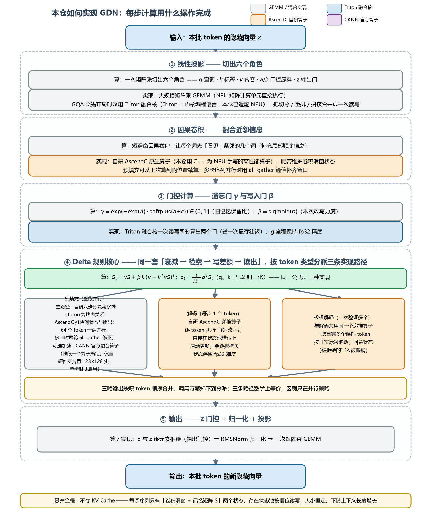
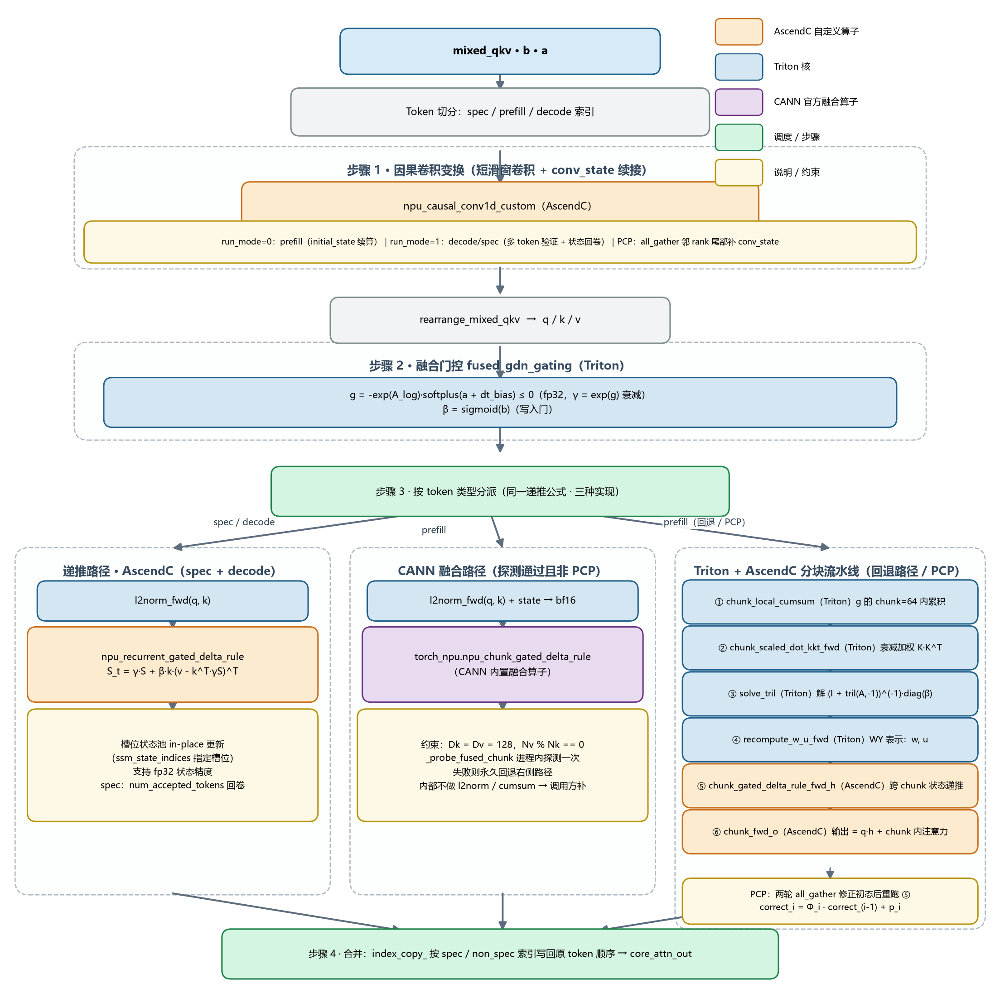
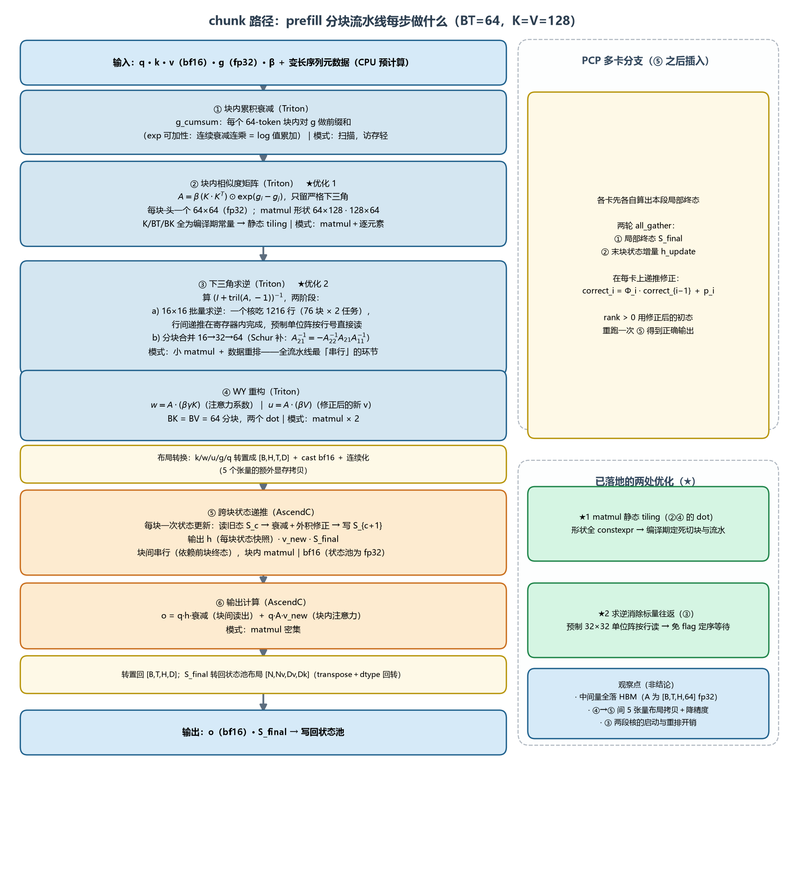
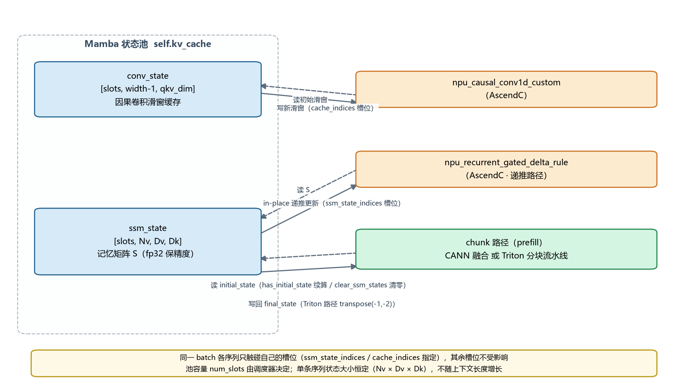

# GDN 算子代码实现解析 — vllm-ascend

> 主入口：`vllm_ascend/ops/gdn.py`（类 `AscendGatedDeltaNetAttention`）
> 本文是**代码实现文档**：只讲"怎么实现的"——代码结构、执行路径、算子分派、状态管理、性能与图捕获适配。
> 算法背景与数学原理（线性注意力、Delta 规则、分块并行）见配套文档 **`GDN_Principles.md`**。
> 本文配图（代码视角流程图）：`gdn_diagrams/gdn_flow_overview.png`、`gdn_flow_core.png`、`gdn_state_pool.png`。

---

## 0. 一句话概览

GDN（Gated Delta Net）是一种线性注意力层：对每条序列维护一个固定大小的记忆矩阵 `S`，逐 token 做"衰减 → 检索旧值 → 写入差额 → 读出输出"。vllm-ascend 的实现把这条递推按 token 类型分派到三条算子路径（prefill 分块并行 / decode 递推 / spec 多 token 验证），并用 **Mamba 状态池**取代 KV Cache。

| | Softmax Attention | GDN |
|---|---|---|
| 复杂度 | O(T²) | O(T) |
| 状态 | KV Cache（随序列长度增长） | 固定大小循环状态 S（RNN 式） |
| 生成阶段 | 每步读取全部历史 KV | 每步只做一次状态递推，天然 O(1) |

---

## 1. 代码结构总览

| 文件 | 职责 |
|---|---|
| `vllm_ascend/ops/gdn.py` | 主类 `AscendGatedDeltaNetAttention`：投影、核心注意力调度、状态读写 |
| `vllm_ascend/ops/gdn_attn_builder.py` | 注意力元数据构建（prefill/decode/spec 切分、chunk 索引预计算、图捕获 padding） |
| `vllm_ascend/ops/triton/fused_gdn_gating.py` | Triton 融合门控核（算 g / β） |
| `vllm_ascend/ops/triton/fla/chunk.py` | Prefill 分块算法编排（Triton + AscendC 混合流水线） |
| `vllm_ascend/ops/triton/fla/*.py` | 分块算法各子步骤核（cumsum、kkt、solve_tril、wy_fast…） |
| `vllm_ascend/ops/triton/mamba/causal_conv1d.py` | 卷积辅助（`extract_last_width` 等） |
| `csrc/attention/recurrent_gated_delta_rule/` | AscendC 递推算子（decode/spec 用） |
| `csrc/attention/recurrent_gated_delta_rule_v310/` | 310P 设备变体 |
| `vllm_ascend/_310p/ops/fla/gdn_310.py` | 310P 的 GDN 实现 |

底层算子分三类：

- **AscendC 自定义算子**（本仓 C++ 源码，运行时经 `ASCEND_CUSTOM_OPP_PATH` 加载）：
  `npu_causal_conv1d_custom`、`npu_recurrent_gated_delta_rule`、`chunk_gated_delta_rule_fwd_h`、`chunk_fwd_o`
- **CANN 官方融合算子**（torch_npu 内置）：`npu_chunk_gated_delta_rule`（prefill 融合路径）
- **Triton 核**（经本仓 Triton 适配层在 NPU 上运行）：门控、cumsum、KKT、solve_tril、WY 重构等

---

## 2. forward 总体流程（三段式）

`AscendGatedDeltaNetAttention.forward()`（gdn.py:181）：

```
hidden_states ──► ① 输入投影 ──► ② 核心注意力(custom op) ──► ③ 输出投影 ──► out
```



### ① 输入投影

按模型配置分两条路径：

- **分离投影**（较新结构）：`in_proj_qkv` → mixed_qkv，`in_proj_ba` → (b, a)，`in_proj_z` → z
- **融合投影**：
  - 常规：`in_proj_qkvz` 一次投影出 qkv 与 z，按 TP 切分宽度 split；
  - **GQA 交错布局**（`gqa_interleaved_layout`，Nv 是 Nk 的整数倍且头交错排布）：调用 Triton 融合核 `fused_qkvzba_split_reshape_cat`，一次完成 qkvz/ba 两块投影的切分、按头 reshape 与拼接，避免多次拷贝。

b、a 均做 `.contiguous()` 为后续 Triton/AscendC 核做准备。

### ② 核心注意力（custom op 边界）

```python
core_attn_out = torch.zeros(...)                     # 注意：用 zeros 而非 empty
torch.ops.vllm.qwen_gdn_attention_core(              # custom op 包装 _forward_core
    mixed_qkv, b, a, core_attn_out, self.prefix, False)
```

两个关键设计：

- **Custom op 包装**：核心计算包成算子调用，使 Dynamo 全图捕获（fullgraph）时把整段计算当黑盒，内部的线程锁、connector 等副作用不会破坏计算图（见 gdn.py:283 注释）；
- **`torch.zeros` 而非 `torch.empty`**：graph replay 场景下避免读到未初始化内存（见 gdn.py:232 注释）。

### ③ 输出投影

```
core_attn_out ──► 与 z 做门控 RMSNorm（self.norm）──► rearrange 合并头 ──► out_proj
```

z 起门控作用：对注意力输出做逐元素调制后再投影，与 Mamba 的输出门类似。

---

## 3. 核心注意力 `_forward_core`（gdn.py:263）

这是算子的主体，分四步（总览图如下，后文分步展开）：



### 3.0 Token 切分

一个 batch 中可能同时存在三类 token（投机解码场景），先按索引拆开：

- **spec tokens**（`spec_token_indx`）：投机解码的多 token 验证请求；
- **prefill tokens**：长 prompt 的 chunked prefill；
- **decode tokens**：普通单步解码。

### 3.1 因果卷积变换（Causal Conv1d）

在进入 Delta 注意力前，qkv 先经过一个短窗因果卷积（`conv1d`，核宽典型为 4）做局部特征混合：

```python
torch.ops._C_ascend.npu_causal_conv1d_custom(
    out, mixed_qkv, conv_weights_T, conv_state=kv_cache[0],
    bias_opt, query_start_loc_opt, cache_indices_opt,
    initial_state_mode_opt, num_accepted_tokens_opt,
    activation_mode, pad_slot_id, run_mode)
```

要点：

- **状态缓存**：`conv_state = kv_cache[0]`，保存每条序列最后 `width−1` 个 token 的输入，使 decode/续算 prompt 时卷积可续接；
- **run_mode**：`0` = prefill（可带初始状态 `initial_state_mode`，即从已算过的位置续算），`1` = decode/spec（每 token 一步）；
- **激活**：`activation_mode` 控制是否在卷积后接 SiLU；
- **PAD_SLOT_ID**：无效槽位哨兵，图捕获 padding 出的假序列不会污染真实状态；
- **PCP（Prefill Context Parallel）分支**：序列并行切分时，非首 rank 没有卷积所需的上文尾部 token，通过 `all_gather` 收集相邻 rank 的 `extract_last_width` 尾巴并写入 conv_state，再本地执行卷积（gdn.py:347-389）。

### 3.2 门控计算（fused_gdn_gating）

Triton 融合核（`fused_gdn_gating.py`），一次读写完成两个门控值：

```
g    = −exp(A_log) · softplus(a + dt_bias)    # 输出 fp32 [1, T, Nv]，恒 ≤ 0
beta = sigmoid(b)                              # 输出同输入 dtype [1, T, Nv]
```

softplus 使用 `threshold=20` 的数值稳定写法（超过阈值直接取 x）。核按 NPU vector core 数分 grid、按 64 行分块，为 decode 场景（seq_len=1）优化。

### 3.3 Delta 规则核心计算（三条路径）

按 token 类型分派到不同算子，这是整个实现的调度核心：

```
                     ┌─ spec tokens ──► npu_recurrent_gated_delta_rule（多 token 验证）
mixed_qkv ──切分──► ├─ decode tokens ► npu_recurrent_gated_delta_rule（单 token 递推）
                     └─ prefill tokens ► npu_chunk_gated_delta_rule（CANN 融合）
                                         或 chunk_gated_delta_rule（Triton+AscendC 流水线）
```

### 3.4 输出合并

三条路径的输出按 `spec_token_indx` / `non_spec_token_indx` 用 `index_copy_` 写回原始 token 顺序（gdn.py:593-605），保证对外语义与 batch 组成无关。

---

## 4. Prefill 路径：分块（Chunk）算法

逐 token 递推无法并行，prefill 长序列时吞吐太低。分块算法基于 **WY 表示（UT 变换）**：把一个 chunk（本实现 `CHUNK_SIZE = 64`）内 64 次"衰减 + Delta 写入"的串行更新，证明可等价改写为几次块矩阵乘法，从而 chunk 内完全并行。

### 4.1 Triton + AscendC 流水线（`chunk.py: chunk_gated_delta_rule_fwd`）

```
g_cumsum = chunk_local_cumsum(g)                     ① chunk 内累积衰减
A = chunk_scaled_dot_kkt_fwd(k, β, g_cumsum)         ② 带衰减/β 加权的 K·Kᵀ 下三角分数
A = solve_tril(A)                                    ③ 解 (I + tril(A,−1))⁻¹·diag(β)
w, u = recompute_w_u_fwd(k, v, β, A, g_cumsum)       ④ WY 表示：w=注意力系数, u=修正后的新 v
h, v_new, S_final = AscendC chunk_gated_delta_rule_fwd_h(k, w, u, g)   ⑤ 跨 chunk 状态递推
o = AscendC chunk_fwd_o(q, k, v_new, h, scale, g)    ⑥ 输出 = chunk 间状态读出 + chunk 内注意力
```



- ①–④ 是纯 Triton 核（移植自 flash-linear-attention）；
- ⑤⑥ 用 AscendC 自定义算子实现（状态递推与输出计算访存密集，AscendC 更适合），输入转成 `[B, H, T, D]` 布局、转 bf16；
- **状态布局**：进入前 `ssm_state` 需转置为 `[N, H, K, V]`（`transpose(-1,-2)`），结束再转回 `[N, Nv, Dv, Dk]`（gdn.py:549、564）；
- **变长序列**：以 `cu_seqlens` 描述序列边界，chunk 索引/偏移由 metadata builder 在 **CPU 侧预计算**后搬到 NPU（`prepare_chunk_indices/offsets` 等），避免热路径 host-device 同步；
- **零长序列压缩**：`_compact_empty_segments` 把空段从 AscendC 核的索引中剔除，结束后用 `keep_meta` 把 final_state 散射回原布局（空段保留初值）。

### 4.2 CANN 融合路径（`_chunk_gated_delta_rule_fused`，gdn.py:97）

`torch_npu.npu_chunk_gated_delta_rule` 把上述整条流水线融成单个 CANN 算子。**实际运行中 §4.1 的 Triton+AscendC 流水线是默认主路径**，CANN 融合算子是条件启用的可选加速——部分 CANN 版本/设备（如 A5，见 gdn.py 的 TODO 注释）不含该算子实现，探测失败即永久回退主路径：

- **可用性探测**：`_probe_fused_chunk()` 在进程内首次调用时跑一次最小 smoke call（B=1、Dk=Dv=128、64 token），失败则永久回退 Triton 路径，结果类级缓存（gdn.py:49-95）；
- 约束：`Dk == Dv == 128`、`Nv % Nk == 0`、仅非 PCP 场景；
- 接口差异适配：期望 TND 布局；**内部不做 q/k L2 归一化、不做 g 的 chunk 内 cumsum**（Triton 版在核内做），故调用方先 `l2norm_fwd(q/k)`、g 直接传原始值；
- `initial_state` 只支持 bf16，而循环状态可能是 fp32，需先 cast；返回后写回 `ssm_state` 时再转回原 dtype。

### 4.3 PCP 序列并行修正（chunk.py:138-195）

各 rank 先各自算出局部 final_state，然后：

```
correct_i = Φ_i · correct_{i−1} + p_i        # Φ_i: rank i 的状态转移, p_i: rank i 的局部更新
```

通过两轮 `all_gather`（final_state + 末 chunk 增量 `h_update`）在所有 rank 上推导出真实初态，rank>0 再用修正后的初态重跑一次 `fwd_h` 得到正确输出。

---

## 5. Decode / Spec 路径：逐 token 递推算子

`torch.ops._C_ascend.npu_recurrent_gated_delta_rule`（AscendC 实现，`csrc/attention/recurrent_gated_delta_rule/`）：

```
o, state = npu_recurrent_gated_delta_rule(q, k, v, g, beta,
                                          state=ssm_state,        # 原地更新 [num_slots, Nv, Dv, Dk]
                                          scale,
                                          actual_seq_lengths,     # 每序列 token 数
                                          ssm_state_indices,      # 各序列在状态池中的槽位
                                          num_accepted_tokens)    # spec: 每序列采纳 token 数
```

特点：

- **槽位化状态池**：`ssm_state` 是全池张量，`ssm_state_indices` 指定本次 batch 各序列读写哪些槽，kernel 内直接对指定槽做 in-place 递推，省去 gather/scatter；
- **fp32 状态支持**：比 CANN 内置实现扩展了 dtype（Triton chunk 路径同样保留 fp32 状态精度）；
- **spec 多 token 验证**：投机解码一个请求一次验证 k 个 draft token，`num_accepted_tokens` 告诉 kernel 每条序列实际要消费几个 token（被拒 token 的写入会被回滚），配合前面 conv1d 的 `run_mode=1` + `num_accepted_tokens_opt` 完成状态回卷；
- 调用前 q/k 已做 `l2norm_fwd`。

混合 batch 场景（同时有 spec 与普通请求）会按 `spec_token_indx`/`non_spec_token_indx` `index_select` 出子张量分别调用，再拼回（gdn.py:438-478、593-605）；普通 prefill+decode 混合 batch 中 decode 部分单独走该算子（`split_non_spec` 分支，gdn.py:485-504）。

---

## 6. 状态管理（Mamba 状态池）

GDN 不用 KV Cache，改用 **Mamba 状态池**，`self.kv_cache` 是二元组（各算子与状态池的交互如下图）：



| 状态 | 形状 | 说明 |
|---|---|---|
| `kv_cache[0]` conv_state | `[num_slots, width−1, qkv_dim]` | 因果卷积滑窗缓存 |
| `kv_cache[1]` ssm_state | `[num_slots, Nv, Dv, Dk]` | Delta 规则循环状态（可为 fp32 保精度） |

- 形状由 `get_state_shape()` → `MambaStateShapeCalculator.gated_delta_net_state_shape()` 统一计算（含 TP 切分、投机 num_spec）；
- prefill 开始时按 `prefill_has_initial_state` 决定从零开始还是从已有状态续算；`clear_ssm_states` 负责把无初态序列的状态清零（高级索引返回副本，就地清零安全，gdn.py:530-534）；
- chunk 路径读写状态伴随 `transpose(-1,-2)` 布局转换（`[Dv,Dk] ↔ [K,V]`），CANN 融合算子与 recurrent 算子的状态布局恰好与 ssm_state 一致、无需转置。

---

## 7. 元数据构建（gdn_attn_builder.py）

`AscendGDNAttentionMetadataBuilder.build()` 为每层核心计算准备全部索引，重活尽量放在 CPU 一次性完成：

- **三路切分**：由 `num_decode_draft_tokens_cpu` 推出 spec 掩码，统计 `num_prefills / num_decodes / num_spec_decodes` 及各自 token 数；`_stable_argsort_for_npu` 生成稳定排序的 token 索引（spec 在后）；
- **chunk 元数据预计算**：`_build_non_spec_chunked_prefill_metadata` 生成 chunk64 索引/偏移、solve_tril 大块索引（1216）、cumsum 分块索引（工作集 2^18），全部 CPU 算好异步搬运，每层复用；
- **图捕获适配**：
  - 单 token 有状态 prefill 归并为 decode（可复用 decode 图，`_treat_single_token_prefills_with_state_as_decodes`）；
  - spec 宽度恰为 `num_spec+1` 的 prompt chunk 折叠进 spec 分支（`_fold_spec_sized_prefill_chunks_into_spec`）；
  - 全图（FULL graph）回放时把空闲 spec 分支输入清零/填 PAD，防止污染上一请求状态（`_reset_spec_decode_graph_inputs`）；
  - decode 图固定 batch 的输入按 `graph_batch_size` padding；
- **conv1d 元数据**：每路的 `query_start_loc / cache_indices / initial_state_mode`。

---

## 8. 关键设计要点小结

1. **一条语义，三条实现路径**：数学上都是同一个 Delta 规则递推，按 token 类型分派到 chunk（并行）或 recurrent（串行）实现；prefill 以 Triton+AscendC 流水线为主路径，CANN 融合算子为条件启用的可选加速（探测失败自动回退）；
2. **精度策略**：g 全程 fp32（log 空间，≤0）；递推状态保 fp32（recurrent 算子、Triton chunk 均支持），仅 CANN 融合路径因算子限制转 bf16；
3. **性能策略**：chunk 元数据 CPU 预计算 + 异步搬运；状态池槽位化 in-place 更新；`torch.zeros` 保证图回放安全；host 侧 `tolist()` 等同步只发生在 builder（每步一次），核心路径无 `.item()`；
4. **功能覆盖**：TP（按头切分）、PCP（prefill 序列并行 + 两轮 all_gather 状态修正）、投机解码（多 token 验证 + 状态回卷 + 混合 batch）、ACL Graph（固定图 padding + 空分支隔离）、310P 老设备独立实现。

---

## 9. 阅读路线建议

1. 先读 `gdn.py` 的 `forward` 与 `_forward_core`，建立"投影 → conv1d → 门控 → 三路核心 → 合并"的主干认知；
2. 对照 §4 公式读 `triton/fla/chunk.py`，理解 WY 分块算法六个子步骤的衔接；
3. 再读 `gdn_attn_builder.py` 的 `build()`，理解所有索引张量的来源（建议结合一次 decode/prefill batch 的具体数值）；
4. 最后按需深入 `csrc/attention/recurrent_gated_delta_rule/` 的 AscendC kernel（tiling / host 侧形状推导）。
