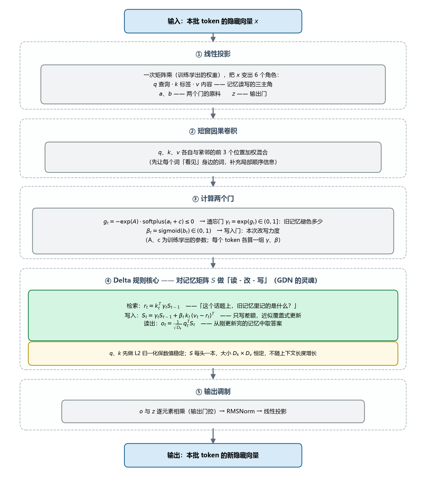
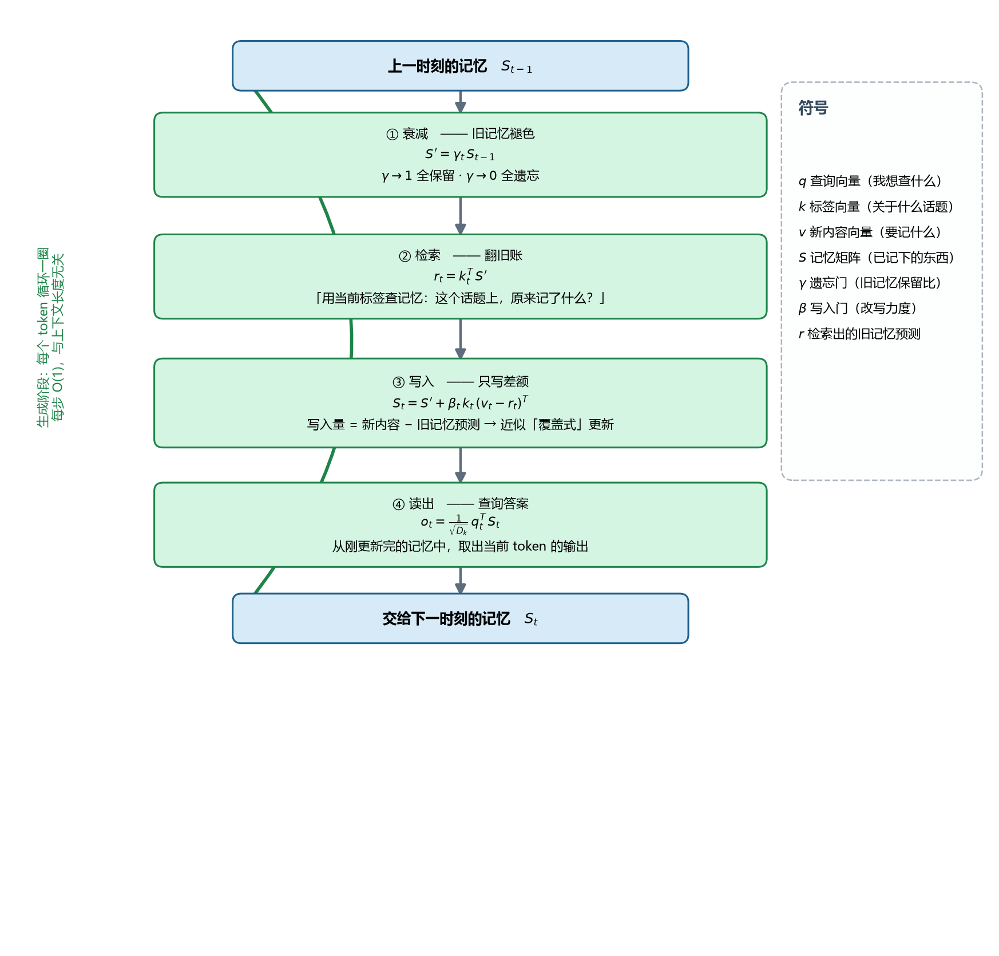
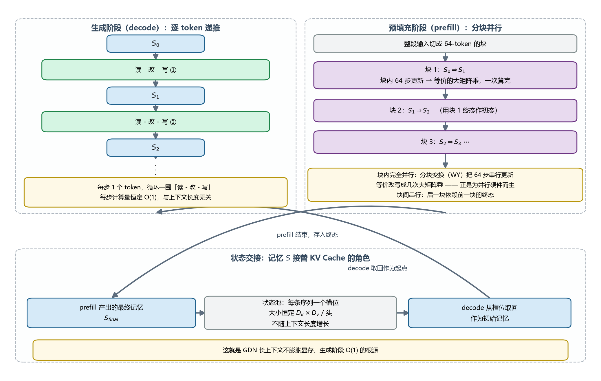

# GDN 原理分析 — 从 Softmax 注意力到门控 Delta 网络

> 本文是**原理文档**：面向未读过代码的读者，只讲"为什么这样设计、数学上在算什么"。
> 不要求任何代码背景；文中不出现函数名与代码路径。
> 配图（原理视角流程图）：`gdn_diagrams/gdn_concept_overview.png`、`gdn_concept_rw_cycle.png`、`gdn_concept_parallel.png`。
> 想了解 vllm-ascend 如何实现这些计算，见配套文档 **`GDN_Implementation.md`**。

---

## 目录

1. [从 Softmax 注意力说起：全员大会的困境](#1-从-softmax-注意力说起全员大会的困境)
2. [线性注意力：把"清单"压成"笔记本"](#2-线性注意力把清单压成笔记本)
3. [GDN 的三个机制：遗忘、改写、读出](#3-gdn-的三个机制遗忘改写读出)
4. [整体计算流程](#4-整体计算流程)
5. [核心一步：读-改-写循环](#5-核心一步读-改-写循环)
6. [两种执行方式与状态交接](#6-两种执行方式与状态交接)
7. [总结：一句话理解 GDN](#7-总结一句话理解-gdn)

---

## 1. 从 Softmax 注意力说起：全员大会的困境

先建立注意力到底在干什么：每个词（token）想更新自己的表示，就要去"查阅"其他所有词。每次查阅涉及三个角色：

- **q（查询）**：我想查什么
- **k（标签）**：每个词身上挂的标签——"我是关于什么的"
- **v（内容）**：每个词实际携带的信息

Softmax 注意力的做法像**开全员大会**——以 3 个词 A、B、C 为例，A 要更新自己：

```
第 1 步 打分：  A 拿 q 分别碰每个人的 k     →  score(A,A)=2.0, score(A,B)=5.0, score(A,C)=1.0
第 2 步 放大：  每个分数过 exp              →  7.4,  148,  2.7     （差距被急剧拉开）
第 3 步 归一：  除以总和，变成百分比         →  A 5%   B 94%   C 2%
第 4 步 混合：  A 的新表示 = 5%·v_A + 94%·v_B + 2%·v_C
```

第 2 步的 exp 是"聚焦"能力的来源：轻微的偏好（2.5 倍）被放大成压倒性的关注（20 倍）。

但这个机制有**两个要害**：

1. **注意力矩阵是 T×T 的大表格**。3 个词只有 9 个分数；10 万 token 的长文就是 100 亿个分数。计算量 O(T²)，这是长上下文昂贵的根源。
2. **归一化的分母依赖所有人**。"B 占 94%"这个数字，是 A 看了**全部** k 之后才算出来的——每个词的注意力权重无法独立预先算好。于是这个方法既拆不开、也变不成递推：每生成一个新 token，都要回头把历史所有词重新打一遍分。这就是为什么 Softmax 注意力必须存下完整的 **KV Cache**（所有历史 token 的 k、v 清单），并且它随序列长度线性膨胀。

## 2. 线性注意力：把"清单"压成"笔记本"

线性注意力的想法：**别开会了，每人把自己的内容写进一本公共笔记本，谁来查就翻笔记本。**

### 2.1 关键一步：为什么 exp 拆不开、别的东西拆得开

"可分解"的准确含义是：打分函数能否写成**"只含 q 的向量"·"只含 k 的向量"** 的内积形式。只要长这样，就能把 q 从求和号里提出来。

用数字演示"提出来"为什么可行。取 `q=[1,2]`，两个历史词：`k₁=[2,0], v₁=10`；`k₂=[0,1], v₂=20`。

**方法 A（逐个打分）**：`score(q,k₁)=2, score(q,k₂)=2`，输出 = `2×10 + 2×20 = 60`。

**方法 B（先攒笔记本，再查询）**：

```
S = k₁v₁ᵀ + k₂v₂ᵀ = [20]     （一本 2×2 的表）
                      [20]
输出 = qᵀ·S = 1×20 + 2×20 = 60    ← 一模一样！
```

两种方法殊途同归不是巧合——点积的结构保证 `qᵀ·(Σ k_s v_sᵀ) = Σ (qᵀk_s)·v_s`，**q 被提进了求和号**，剩下 `S = Σ k_s v_sᵀ` 与 q 完全无关。S 只依赖历史，可以逐 token 递推累积，也可以被任何后来的 q 复用。

而 exp 为什么不行？Softmax 的分子是 `Σ exp(q·k_s)·v_s`，**exp 作用在 q·k_s 这个乘积的和上**：

```
exp(a + b) = exp(a)·exp(b)     ← 只对"和"成立
exp(a × b) = ???                ← 对"积"没有任何拆分法则
```

q 和 k 的分量在 exp 里面纠缠成一个整体，没有任何代数手段拆成 `f(q)·g(k)`。q 提不出去，就只能每个 q 和每个 k_s 单独碰一次——T×T 大表由此而来。

线性注意力于是**把 exp 换成一个拆得开的变换 φ**（经典选择如 `elu(x)+1`，逐元素、输出恒正）：

```
score(q, k) = φ(q)ᵀ·φ(k)     ← 又回到"分项相乘再求和"，可以拆！
```

分母同理可拆：`Σ φ(q)ᵀφ(k_s) = φ(q)ᵀ·z`，其中 `z = Σ φ(k_s)` 也是逐 token 递推的向量。分子分母都变成了"递推累积的固定大小对象 + 一次查询"。

**一个漂亮的视角**：严格说 `exp(q·k)` 也能写成内积——但对应的特征映射是**无穷维**的（核函数理论）。所以 Softmax 注意力 = 用无穷维 φ 的线性注意力：表达力强是因为"状态"有无穷容量；无穷维存不下来，只好退而存原始 (k,v) 清单——KV Cache。线性注意力把 φ 换成低维便宜版，状态从"无穷大"缩到固定大小，代价是**有损压缩**。

### 2.2 S 的意义：一本"关键词 → 内容"的联想记忆表

用 2 维玩具例子看 S 里存了什么。两个词写入：

```
词1："我的标签是『动物类』(k=[1,0])，内容是 [10, 20]"   → 写到表第 1 行
词2："我的标签是『动作类』(k=[0,1])，内容是 [30, 40]"   → 写到表第 2 行

S = [[10, 20],
     [30, 40]]
```

查询时，`q=[1,0]`（"我关心动物类"）去翻表：`qᵀ·S = [10,20]`——一翻就翻到词 1 的内容；`q=[0.8, 0.2]` 则得到按相似度比例混合的记忆。

所以：

> **S 是这一层对"到目前为止整个上文"的全部记忆，以"看到什么样的关键词 → 混合出什么内容"的形式存储。**

它是**有损压缩**：真实模型里成千上万个词的 k 都挤在同一块空间里，必然互相覆盖、串味——这个压缩失真问题正是后续所有改进（包括 GDN）的出发点。

关于命名：正式场合叫**状态矩阵**（state，RNN/SSM 传统，强调"被递推更新的隐藏状态"）；理解时不妨叫**记忆矩阵**（强调"供检索的联想记忆"）。文献里的 hidden state、fast weights（快速权重）指的都是它或其变体。

### 2.3 为什么要"更新"它

线性注意力的运行方式决定了：

```
每来一个新 token t，只发生两件事：
读：o_t = q_tᵀ · S          ← 从"上文记忆"里取出需要的上下文
写：S ← 更新(S, k_t, v_t)    ← 把自己也写进记忆，让后面的词能看到我
```

> **如果词 t 不把自己写进 S，它对后面所有词来说就像从没存在过。**

没有 KV Cache 兜底——S 是唯一的记忆载体。更新 S 不是为了当前 token，而是**为了未来所有 token 还能查到它**。

### 2.4 S 的固定大小怎么确定

S 是所有 `k_t·v_tᵀ` 的累加，形状就是外积的形状：`k ∈ R^{Dk}，v ∈ R^{Dv}`，所以每头 `S ∈ R^{Dk×Dv}`。

- **Dk、Dv 是模型设计时定死的架构超参**（典型值 128×128）；
- 乘上头数（每个 v-head 一本独立的笔记）和并行切分，就是单卡单层的状态总量；
- 它**不随序列长度变化**：1k 还是 100 万 token 的上文，都压进同一张表。

数字直觉（Qwen3-Next-80B，单序列、单层）：`32 头 × 128×128 ≈ 1MB`（bf16）——无论上下文 4K 还是 1M。而同模型全注意力层的 KV Cache 在 1M 上下文时以 GB 计。

## 3. GDN 的三个机制：遗忘、改写、读出

纯加性写入（`S += k·vᵀ`）的笔记本会变成垃圾场：

```
问题 1：越写越大       → 信息无限堆叠，数字溢出
问题 2：旧信息赖着不走 → "巴黎是法国首都"已写入，后来文章说首都迁了——旧内容还留在表里，查询时新旧一起冒出来
```

线性注意力家族的改进谱系：

```
纯线性注意力：  S += k·vᵀ                        ← 垃圾场，什么都留着
              ↓
RetNet/Mamba：  S = γ·S + k·vᵀ                   ← 加"遗忘"γ，旧笔记定期褪色
              ↓
GDN：          S = γ·S + β·k·(v − 检索值)ᵀ        ← 写之前先查旧账，只写"需要修正的差额"
```

GDN 逐 token 的完整递推：

```
γ_t = exp(g_t)  (g_t ≤ 0)          遗忘门：旧记忆保留比例，γ→1 全保留，γ→0 全遗忘
β_t = sigmoid(b_t)                 写入门：本次改写力度

① 衰减：  S' = γ_t · S_{t−1}
② 检索：  r_t = k_tᵀ · S'          "这个话题上，旧记忆里记的是什么？"
③ 写入：  S_t = S' + β_t · k_t · (v_t − r_t)ᵀ
④ 读出：  o_t = (1/√Dk) · q_tᵀ · S_t
```

三个机制各自解决什么：

1. **遗忘门 γ**：对旧状态做指数衰减，让模型能主动淘汰过时信息（数值上还防溢出）。g 存 log 空间（≤0），好处是连续 token 的衰减可直接**累加**：`γ_1·γ_2·…·γ_t = exp(g_1+…+g_t)`——这正是后文 prefill 分块算法里"块内累积衰减"一步的数学基础；
2. **Delta 规则**：写入前先检索旧值，只写差额 `v_t − r_t`。用人话说：**在写"猫有四条腿"之前，先查笔记本里原来怎么写猫的，把旧内容减掉，再写新值**——从"叠加"变成近似"改写"，最接近 Softmax 注意力精确覆盖旧信息的能力；
3. **L2 归一化**：q、k 归一化到单位长度，保证状态矩阵的谱范数受控、训练稳定。

门控原料 `a`、`b` 来自输入投影（见下节），具体计算：

```
g_t = −exp(A) · softplus(a_t + c) ≤ 0     （A、c 为训练学出的参数）
β_t = sigmoid(b_t)
```

## 4. 整体计算流程



### 4.0 输入是什么

严格说，GDN 层每一步的输入是**"一个新输入 + 两个随身状态"**：

```
x：本批 token 的隐藏向量（新输入，每批换新）
S_prev：之前的记忆矩阵（每层、每序列各一本，跨步持久）
conv_state：卷积滑窗尾巴（本批 token 之前紧邻几个位置的输入，供卷积续接）
```

**x 是什么**：每个 token 被"词嵌入 + 前面所有层"加工出来的当前隐藏向量，一锅**还没分工**的混合信息——此刻每个 token 只有一个向量，尚无 q/k/v 的区分。

**状态从哪来往哪去**：S_prev 和 conv_state 不随 batch 传入，而是存在**状态池**里（每层、每序列一个槽位），按槽位索引取出、算完原地写回。新序列第一次进来看不到 S_prev（零初始化）；只有续算 prompt、decode 步进时才有非零的 S_prev。

### 4.1 五步流程

1. **线性投影（分工）**：用训练学出的权重把一锅混合信息 x 拆成六个角色——q（查询）、k（标签）、v（内容）、a 与 b（两个门的原料）、z（输出门）。与标准 Transformer 的 QKV 三投影是同一个模式，只是角色更多；
2. **短窗因果卷积**：q、k、v 各自与紧邻的前 3 个位置加权混合——先让每个词"看见"身边的词，补充局部顺序信息（线性注意力本身没有位置概念，卷积补上了局部性）；
3. **计算两个门**：由 a、b 算出每 token 的 γ（遗忘）与 β（写入），公式见 §3；
4. **Delta 规则核心**：对记忆矩阵 S 做"读-改-写"，见 §5 详解；
5. **输出调制**：核心输出 o 与 z 逐元素相乘（输出门控）→ 归一化 → 线性投影，得到本层输出。

## 5. 核心一步：读-改-写循环



生成阶段每个 token 绕这个圈一圈：

```
① 衰减 —— 旧记忆褪色          S' = γ_t · S_{t−1}
② 检索 —— 翻旧账              r_t = k_tᵀ · S'
③ 写入 —— 只写差额            S_t = S' + β_t · k_t · (v_t − r_t)ᵀ
④ 读出 —— 查询答案            o_t = (1/√Dk) · q_tᵀ · S_t
```

两个值得体会的细节：

- **读的是刚写完的 S_t**：当前 token 的输出已经包含自己刚写入的信息（o_t 里有 v_t 的成分）；
- **写入量 = 新内容 − 旧预测**：如果旧记忆已经"预测"对了（r_t ≈ v_t），几乎不写；差得越远，改写越猛。这是 Delta 规则的全部精髓。

每步计算量恒定 O(1)，与上下文长度无关——这就是 GDN 生成阶段快、显存不涨的根源。

## 6. 两种执行方式与状态交接



同一个递推公式，按场景选择两种执行方式：

### 6.1 生成阶段（decode）：逐 token 递推

每步 1 个 token，老老实实绕"读-改-写"一圈。慢？不慢——每步只有几次小矩阵乘，O(1)。生成阶段本来就是一个 token 一个 token 地出，递推与生成本天然同构。

### 6.2 预填充阶段（prefill）：分块并行

处理整段 prompt 时逐 token 递推就太慢了。但"衰减 + Delta 写入"的递推**没法直接并行**：Delta 规则里 S 出现在等式右边（检索 `kᵀ·S` 依赖之前所有步的结果），不像纯加法线性注意力那样满足结合律、能用简单的并行扫描。

解法是**分块 + WY 变换**：

- 把整段输入切成 **64-token 的块**；
- **块内**：用一种代数变换（WY 表示 / UT 变换）证明——64 步串行的"衰减 + Delta 写入"**等价于几次大矩阵乘**，一次并行算完；
- **块间**：串行，后一块以上一块的终态为初态。

结果：整段 prompt 的计算量 O(T)（对比 Softmax 的 O(T²)），且块内形状规整、对并行硬件（矩阵乘单元）极度友好。

### 6.3 状态交接：S 接替 KV Cache 的角色

```
prefill 算完整段 prompt ──► 产出最终记忆 S_final ──► 存入状态池（每序列一个槽位）
                                                        │
decode 每个 token ◄── 从槽位取回，作为下一步的 S_prev ────┘
```

状态池里每条序列的状态大小恒定（`Dk×Dv` × 头数），不随上下文长度增长。**这就是 GDN 长上下文不膨胀显存、生成阶段 O(1) 的根源**——KV Cache 的两个要害（§1）在此被同时解决。

## 7. 总结：一句话理解 GDN

| | Softmax 注意力 | 纯线性注意力 | GDN |
|---|---|---|---|
| 比喻 | 全员大会，两两对视打分 | 公共笔记本，纯叠加写入 | 笔记本 + 遗忘 + 查旧账改写 |
| 计算量（prefill） | O(T²) | O(T) | O(T)（分块并行） |
| 生成一步 | O(T)，翻全部历史 KV | O(1) | O(1) |
| 存储 | KV Cache，线性膨胀 | 固定大小 S | 固定大小 S（状态池） |
| 信息更新能力 | 精确（归一化 + exp 竞争） | 只能叠加，不能改写 | 近似改写（Delta 规则） |
| 主要短板 | 长、贵 | 记忆串味、旧信息赖着不走 | 递推不可直接并行（用 WY 分块补） |

三步递进的因果链：

> **换掉打分函数（数学）→ 历史能压进固定大小的记忆矩阵 S → 换来 O(1) 推理和恒定显存（但有损）→ 用 γ 遗忘 + Delta 差额改写把损失补回来（但递推串行）→ 用 WY 分块算法把并行性补回来。**

每一步都是在解决上一步引入的问题——GDN 的设计史就是这条因果链。

---

## 附：从原理到代码的对应关系

读原理后想落地到 vllm-ascend 实现，概念与代码入口的对照（详见 `GDN_Implementation.md`）：

| 原理概念 | 实现入口（vllm_ascend） |
|---|---|
| 记忆矩阵 S / 状态池 | `ssm_state`（`kv_cache[1]`），槽位化管理 |
| 卷积滑窗状态 | `conv_state`（`kv_cache[0]`） |
| 读-改-写一步（decode/spec） | `npu_recurrent_gated_delta_rule`（AscendC 算子） |
| 分块并行（prefill） | CANN 融合算子 `npu_chunk_gated_delta_rule`，或 Triton+AscendC 六步流水线 |
| 两个门的计算 | `fused_gdn_gating`（Triton 核） |
| 块内累积衰减（exp 可加性） | chunk 流水线的 `chunk_local_cumsum` 步骤 |
| 状态交接（prefill→decode） | 状态池槽位索引 + `has_initial_state` 续算逻辑 |
