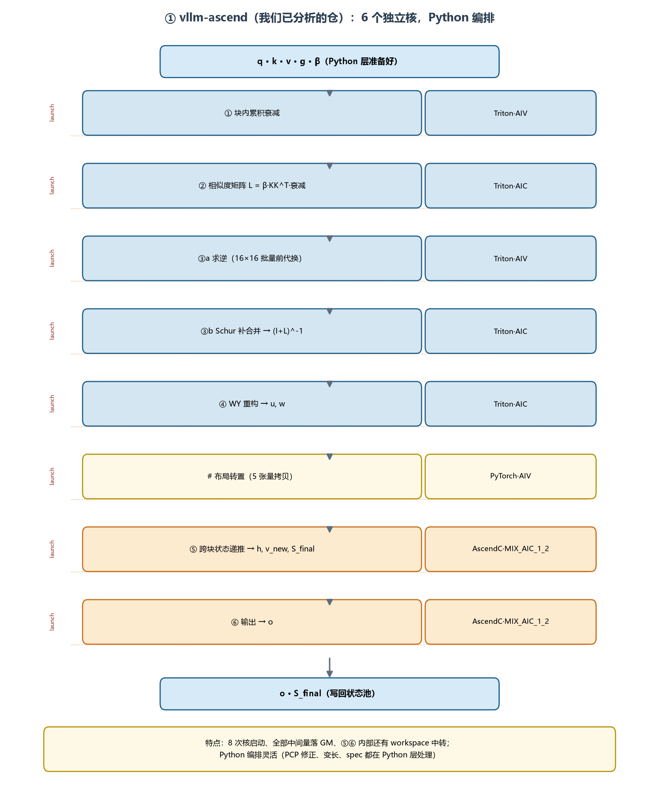
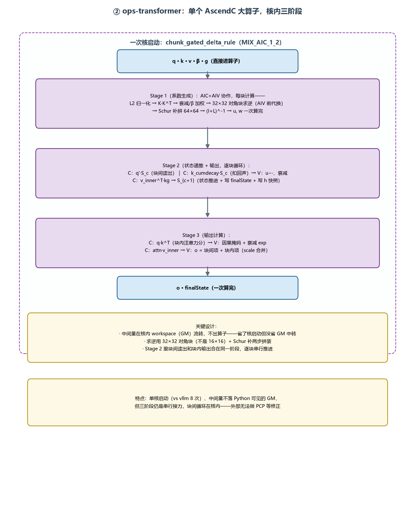
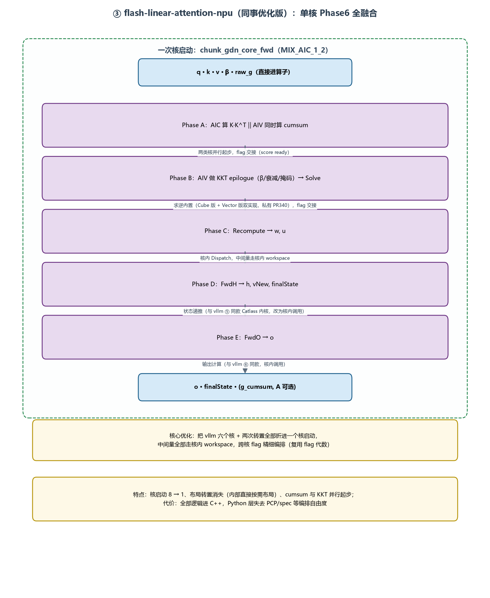

# GDN 三版实现对比：vllm-ascend / ops-transformer / flash-linear-attention-npu

> 本文以 vllm-ascend（`vllm_ascend/ops/gdn.py` 起的六步流水线）为基线，对照另外两版代码：
> - **ops-transformer**：`attention/chunk_gated_delta_rule`，单个 AscendC 大算子（核内 Stage 1/2/3）
> - **fla-npu（同事优化版）**：`fla/ops/ascendc/gdn/...`，单核 Phase6 全融合；最新进展看 `perf/gdn-a5-ho-generalized-pr` 分支（H/O 块级流水）
>
> 配图：`gdn_diagrams/cmp_vllm_ascend.png`、`cmp_ops_transformer.png`、`cmp_fla_npu.png`。
> 代码层面的血缘结论：**fla-npu 以 vllm-ascend 为基础优化**（⑤⑥ 直接复用同款 Catlass kernel，六个中间算子一一对应）；ops-transformer 是独立实现（求逆 32×32、三段式结构、无继承关系）。

---

## 1. 总体架构对比

| | vllm-ascend | ops-transformer | fla-npu |
|---|---|---|---|
| 形态 | Python 串联 6 个独立核 | 单个 AscendC 算子，核内 3 阶段 | 单个 AscendC 算子，核内 Phase A-E |
| 核启动次数 | 8（含 2 次转置） | 1 | 1 |
| 语言 | Triton（①-④）+ AscendC（⑤⑥）+ Python 编排 | 全 AscendC | 主体 AscendC（Python 仅 ctypes 薄壳；Triton 只留存量核） |
| ①-④ 在哪 | 4 个独立 Triton 核 | Stage 1（核内融合） | Phase A+B+C（核内，cumsum‖KKT 并行起步） |
| ⑤⑥ 在哪 | 2 个独立 AscendC 算子 | Stage 2+3（部分合并） | Phase D+E（核内调用同款 Catlass kernel） |
| 布局转置 | 有（5 张量拷贝，~26% 流量） | 无（核内直接） | 无（核内直接） |
| 中间量落盘 | 全落 GM（Python 可见） | 核内 workspace | 核内 workspace |
| 求逆 | Triton 16×16 批量前代换（38 块一批） | AscendC 32×32 前代换 + 2 次 Schur 补矩阵乘 | AscendC 私有 SolveTri（Cube/Vector 双实现，16/32/64 dispatch） |
| 混合核编舞 | ⑤⑥ 是 MIX_AIC_1_2，内部 flag 互锁 | 同左 | 同左 + flag 代数复用 + **H/O 块级流水（perf 分支）** |
| Python 编排自由度 | 高（PCP 修正、spec、CANN 回退都在 Python） | 低（算子内固定） | 低 |
| 功能覆盖 | PCP / 投机 / 变长 / 图捕获 | 基础前向 | 基础前向（变长已修，PCP/spec 缺） |







---

## 2. 逐阶段对照：三版怎么实现六步的每一步

约定行 = vllm 六步流水线的步骤；三列 = 三版各自的实现位置和方式。

| 阶段 | vllm-ascend | ops-transformer | fla-npu |
|---|---|---|---|
| ① 块内累积衰减（gcum） | 独立 Triton 核（AIV），grid=(块组, B)，工作集预算定块组=256 token | Stage 1 内 AIV 拍：`GCumExpCompute`（CumSum 指令 + Exp） | Phase A：AIV `RunPhase6Cumsum`，**与 AIC 的 K·Kᵀ 同时起步**（跨核并行） |
| ② 相似度矩阵 L | 独立 Triton 核（AIC 常驻，★1 静态 tiling）：dot(k,kᵀ)→×β→exp→掩码 | Stage 1 内 AIC 拍：`AICProcess(key, key)` 算 KKᵀ；AIV 拍 `KKBetaCompute` 加权 | Phase A：AIC `ChunkKktCube` 写 score workspace；Phase B AIV `KKT epilogue` 做 β/衰减/掩码 |
| ③ 求逆 (I+L)⁻¹ | ③a Triton（AIV，16×16 批量前代换，38 块一批，★2 单位阵查表）+ ③b Schur 补合并（AIC） | Stage 1 内：AIV `InverseAIV`（**32×32** 前代换，Gather/Broadcast/MulAdd）+ `AttnInverseMMCompute`（2 次小矩阵乘拼 64×64） | Phase B：`RunSolvePhase`（私有 PR340 SolveTri，Cube 版+Vector 版双实现，arch35 下 16/32/64 特化头文件） |
| ④ WY 重构（u, w） | 独立 Triton 核（AIC）：Vector 预缩放 → 2 个 dot | Stage 1 内：`AICProcess(attn, gBK/vBeta)` 两个矩阵乘直接产出 k_cumdecay、v_inner（等价物） | Phase C：`DispatchRecompute`（核内调用，w/u 走核内 workspace） |
| ⊘ 布局转置 | **有**：5 张量 transpose+contiguous（PyTorch，~26% 流量） | **无**（核内直接按需布局） | **无**（核内直接按需布局） |
| ⑤ 跨块状态递推（h, vNew, S_final） | 独立 AscendC 算子 `chunk_gated_delta_rule_fwd_h`（MIX_AIC_1_2，C1/V1/C2/V2 四拍 + ping-pong 2 流） | Stage 2：逐块循环（CalVPrime 扣回声 → CalAttnInter 块间读出 → CalStateNew 推进），**无 ping-pong，裸串行** | Phase D：`DispatchFwdH`——**同款 Catlass kernel**（四拍编舞一致，直接复用 vllm 的实现） |
| ⑥ 输出计算（o） | 独立 AscendC 算子 `chunk_fwd_o`（五拍：qkᵀ→掩码→q·h→attn·vNew→合并） | Stage 3：`CalMaskedQKT`（重算 scale_qkt）→ AIC attn·vInner → **IterateAll(out, 1) 原子累加到 Stage 2 已写的 out 上** | Phase E：`DispatchFwdO`——同款 kernel；**perf 分支：D→E 做成块级流水**（IBSet/IBWait 按块 rendezvous，16 生产者组:12 消费者组） |
| o 的两路合并 | ⑥ V2 在 UB 里相加后一次写出 | **两次写 + 原子累加**（Stage 2 写块间项，Stage 3 原子加块内项） | UB 内合并（同 vllm） |
| 状态池交互 | gather/transpose 进出（4 次拷贝） | 直接读写 initialState/finalState 参数 | 直接读写（含 FP32 初态路由） |

---

## 3. 可优化点对照：vllm 分析出的 A-G，另外两版做了没有

以 vllm-ascend 的 roofline 分析和优化清单（`GDN_Implementation.md` §9）为基线：

| 优化项 | 内容 | vllm-ascend | ops-transformer | fla-npu |
|---|---|---|---|---|
| **A** | 消除④→⑤布局转置（~26% 流量） | 未做（5 张量拷贝） | ✅ 已做（核内直接布局） | ✅ 已做 |
| **B** | ②③④ 融合单核（L/Ai 不落盘，~17%） | 未做（4 个独立核） | ✅ 已做（全在 Stage 1，workspace 中转） | ✅ 已做（Phase A-C，且 cumsum‖KKT 跨核并行起步） |
| **C** | ③ 求逆换矩阵乘倍增（串行深度 15→6） | 未做（前代换） | 部分（32×32 前代换 + 2 次小矩阵乘拼装，仍是行递推） | 部分（双实现 + 尺寸 dispatch，仍是前代换族） |
| **D** | ⑤⑥ 融合/状态驻片（免 h/vNew 往返） | 未做（两算子独立） | 部分（Stage 2/3 分开但同算子内；h 快照仍落 workspace） | 大部分（同核内顺序调用；h/vNew 仍经核内 workspace，但 **perf 分支 D→E 块级流水**把等待消掉了） |
| **E** | 状态池 gather/transpose 消除 | 未做（4 次拷贝） | ✅ 已做（直接读写初/终态） | ✅ 已做 |
| **F** | 门控/l2norm/cumsum 小核合并 | 未做 | ✅（门控并入 Stage 1 的 QKPreProcess/L2Norm 流程） | ✅（cumsum 进 Phase A） |
| **G** | ② exp 只算下三角 | 未做 | — | — |
| （超出清单） | **相位间流水化**（全局屏障 → 块级 rendezvous） | 不适用（Python 编排，粒度是核） | 未做（三阶段硬串行） | ✅ **perf/gdn-a5-ho-generalized-pr 已做 D→E**（IBSet/IBWait、16:12 核组分工、tiling 下发资格） |
| （超出清单） | ⑤ 加 ping-pong 双缓冲 | ✅ 已有（PING_PONG_STAGES=2） | ❌ 未做（Stage 2 裸串行） | ✅ 已有（继承 vllm） |

**清单之外两版各自的特色**：

- **fla-npu**：cumsum 与 K·Kᵀ 跨核并行起步（AIC/AIV 同时干活）；flag 代数复用（相位间不复位、按代数交接）；workspace 尾部复用当 ready 信号区；变长 chunk 偏移已修进 ready 信号；FP32 初态路由保精度。
- **ops-transformer**：Stage 2/3 用**原子累加**合并 o 的两路（省一次读改写，但引入原子开销）；求逆的 Gather/Broadcast 向量化前代换写得较完整。

---

## 4. 各版剩余的优化空间（互相参考）

| 剩余空间 | vllm-ascend | ops-transformer | fla-npu |
|---|---|---|---|
| 布局转置 | **A 未做（最大单项，8-15%）** | 已无 | 已无 |
| ②③④融合 | **B 未做（~10%）** | 已无 | 已无 |
| ⑤⑥融合/流水 | D 未做 | Stage 2 无 ping-pong；o 两次写+原子累加 | A→B→C→D 仍是全局屏障；生产者/消费者比例（16:12）固定 |
| 求逆 | C 未做（可维护性红利） | 32×32 固定，无 dispatch | 已有 dispatch，倍增法仍可试 |
| 小核合并 | F 未做 | 已无 | 已无 |
| workspace L2 局部性 | 不适用（中间量直接 GM） | 可做 | 可做（ready 信号、A/w/u/h 的核组局部排布） |
| 功能（PCP/spec/图捕获） | ✅ 有 | ❌ 缺 | ❌ 缺（变长已修） |

**一句话**：三版是同一数学的三档工程形态——vllm 用 Python 编排换调度自由度（PCP/spec/图捕获），ops-transformer 和 fla-npu 用全下沉换性能；fla-npu 又在下沉形态里把 vllm 清单的 A/B/E/F 全部做完、D 做了大半，并自创了 H/O 块级流水。**vllm 侧最值得吸收的是同事的融合思路（A+B），fla-npu 侧最缺的是 vllm 的调度层（PCP/spec）——两边互补。**

---

## 5. 附：perf 分支（H/O 流水）的关键机制速查

```
启用条件：HoPipelineContext（host tiling 下发 enabled + producer/consumer 组数）
信号机制：FwdH 每完成一个 (块,头) 的 V2 拍 → IBSet 置位 GM ready 槽（32B/槽）
         FwdO 消费者任务 → IBWait 自旋等待对应槽 → 立即开算该块的 o
核组分工：28 个 Cube 核 = 16 生产者组（FwdH）+ 12 消费者组（FwdO）
初始化：  28 组分布式清零 ready 槽，避免单点和陈旧状态
演进：    38bee192 硬编码单场景（seqlen==11274）→ a528d8f8 泛化（tiling 资格）→ a0342e03 GEN-v2 布局门
```
